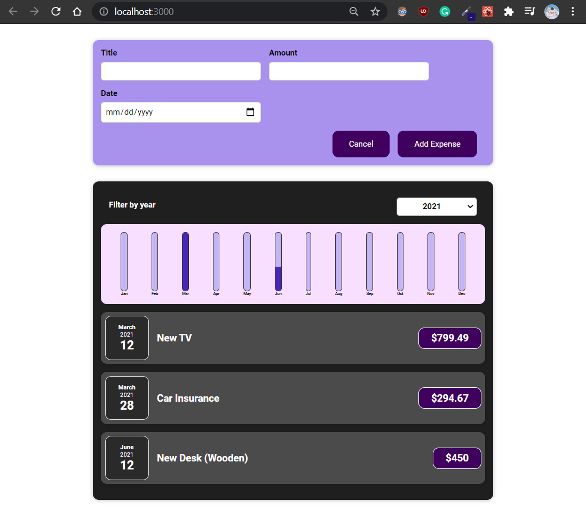

# Expenses tracker

An introduction to:

- Components, custom components, JSX
- Passing data via Props
- Event handlers and working with State
- Hooks (useState)
- Working with one and multiple States
- Two way binding
- Bottom-up component (Child-to-parent)
- Keys and conditional return statements

# Screenshot

